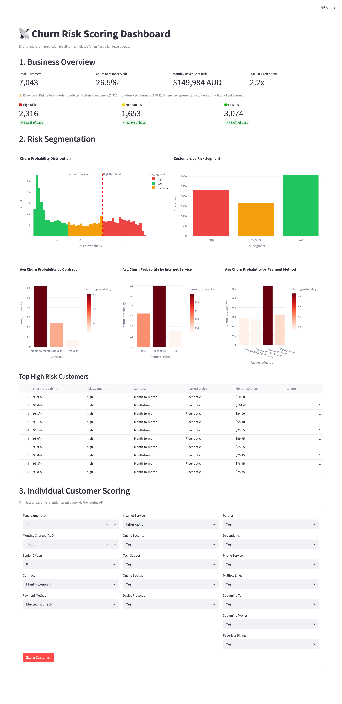
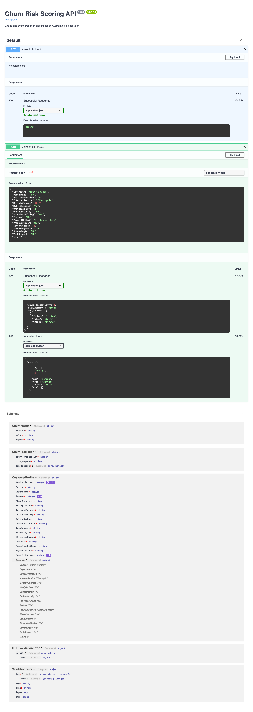
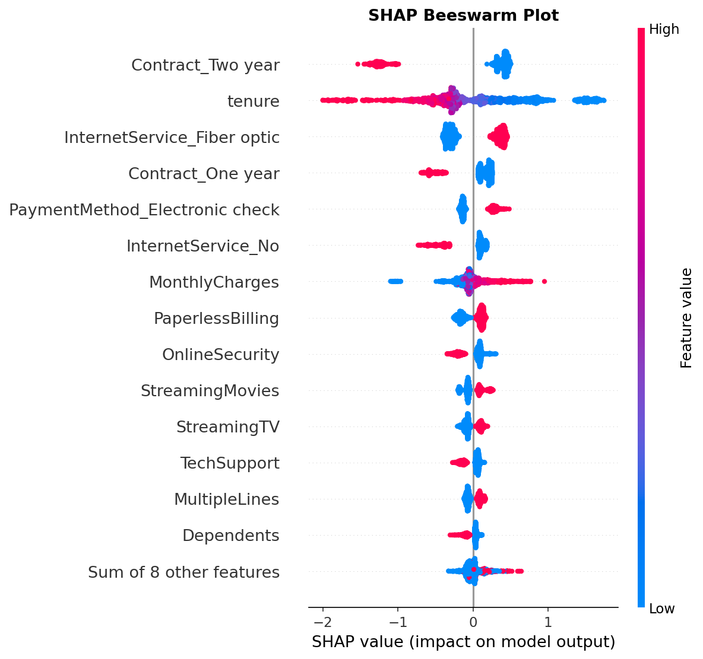

# churn-risk-scoring

> End-to-end churn risk scoring pipeline simulated for an Australian telecommunications operator.


---

## Overview

Customer churn is one of the highest-impact problems in the telecommunications industry. This project builds a end-to-end churn risk scoring system — from raw data to a live REST API and business dashboard — framed as a real solution for an Australian telco operator (Telstra/Optus market context).

The system assigns a churn probability score to every customer, segments them by risk level, and explains each prediction using SHAP values. At an ARPU of AUD $64.76/month, the model identifies over $149,000 in monthly recurring revenue at risk.

Every component is productionized: reproducible pipeline, versioned data, tracked experiments, containerized services, and tested API endpoints.

---

## Dashboard



---

## API



---

## Business Context

| Metric | Value |
|---|---|
| Dataset | IBM Telco Customer Churn — 7,043 customers |
| Churn Rate | 26.5% |
| ARPU | AUD $64.76/month |
| Monthly Revenue at Risk | ~AUD $149,984 |
| CLV at Risk | ~AUD $3,599,620 |
| Cost to Retain All High-Risk | AUD $34,740 |
| ROI (50% retention success) | 2.2x |

---

## Model Performance

Three models were evaluated. LightGBM was selected as the production model after Optuna hyperparameter tuning.

| Model | ROC-AUC | PR-AUC | Recall | F1 |
|---|---|---|---|---|
| Logistic Regression | 0.839 | 0.630 | 0.778 | 0.617 |
| Random Forest | 0.844 | 0.641 | 0.781 | 0.625 |
| **LightGBM (tuned)** | **0.847** | **0.668** | **0.808** | **0.623** |

Recall is the primary business metric — at an average CLV of AUD $1,554 (AUD $64.76 × 24 months), missing a churner costs ~100x more than a false positive retention action (AUD $15).

---

## SHAP — Global Feature Importance



Top predictors identified:

- **Contract type** — Month-to-month customers churn at 42.7% vs 2.8% for two-year contracts
- **Tenure** — Strong negative correlation (-0.35) with churn. Risk concentrates in first 5 months
- **Internet Service** — Fiber optic customers churn at 41.9% despite being the premium tier
- **Payment Method** — Electronic check: 45.3% churn vs ~15% for automatic payment methods
- **Online Security / Tech Support** — Absence of these services nearly triples churn rate

---

## Architecture

```
Raw Data (Kaggle)
      │
      ▼
make_dataset.py          ← Downloads dataset automatically via Kaggle API
      │
      ▼
preprocessing.py         ← Cleaning, encoding, feature engineering
      │
      ▼
tune.py                  ← Optuna hyperparameter optimization (50 trials, 5-fold CV)
      │
      ▼
train.py                 ← LightGBM training + MLflow experiment tracking
      │
      ▼
evaluate.py              ← SHAP global explanations + artifacts
      │
      ▼
predict.py               ← Batch scoring → churn_scores.csv
      │
      ▼
api/main.py              ← FastAPI scoring endpoint + SHAP local explanations
      │
      ▼
dashboard/app.py         ← Streamlit business dashboard
```

---

## Project Structure

```
churn-risk-scoring/
│
├── data/
│   ├── raw/                  # Raw dataset (DVC tracked)
│   ├── processed/            # Engineered features (DVC tracked)
│   └── outputs/              # Batch scores
│
├── notebooks/
│   ├── 01_eda.ipynb          # Exploratory data analysis
│   └── 02_business_analysis.ipynb  # Revenue impact analysis
│
├── src/
│   ├── data/
│   │   ├── features.py       # Centralized feature definitions
│   │   ├── make_dataset.py   # Kaggle data download
│   │   └── preprocessing.py  # Feature engineering pipeline
│   ├── models/
│   │   ├── train.py          # Model training + MLflow tracking
│   │   ├── tune.py           # Optuna hyperparameter tuning
│   │   ├── evaluate.py       # SHAP evaluation + metrics
│   │   └── predict.py        # Batch scoring
│   └── tests/
│       └── test_preprocessing.py  # 14 preprocessing tests
│
├── api/
│   ├── main.py               # FastAPI app
│   ├── schemas.py            # Pydantic request/response models
│   └── tests/
│       └── test_api.py       # 11 endpoint tests
│
├── dashboard/
│   └── app.py                # Streamlit dashboard
│
├── configs/
│   ├── config.yaml           # Main Hydra config
│   ├── dataset/
│   │   └── kaggle.yaml       # Dataset source config
│   └── model/
│       ├── lightgbm.yaml     # Tuned hyperparameters (auto-updated by tune.py)
│       ├── logistic_regression.yaml
│       └── random_forest.yaml
│
├── images/                   # README assets and SHAP visualizations
├── artifacts/                # SHAP values and metrics.json (DVC tracked)
├── models/                   # Trained model artifacts (DVC tracked)
├── conftest.py               # Pytest fixtures and model mocks
├── dvc.yaml                  # Reproducible pipeline definition
├── dvc.lock                  # Pipeline state lock
├── Dockerfile
├── docker-compose.yaml
├── pyproject.toml
└── requirements.txt
```

---

## Quickstart

> **Managing dependencies:** `requirements.txt` is a fully pinned lock file
> generated by `pip-compile`. To add or update a dependency, edit `requirements.in`
> and run:
> ```bash
> make update-deps
> ```

### Option A — Docker (recommended)

```bash
git clone https://github.com/robertogarces/churn-risk-scoring.git
cd churn-risk-scoring
docker compose up --build
```

- Dashboard: `http://localhost:8501`
- API docs: `http://localhost:8000/docs`

> **Note:** The Docker setup uses pre-built model artifacts mounted as volumes.
> To run the full pipeline from scratch, use Option B.

### Option B — Local

**1. Create environment**
```bash
conda create -n churn-risk-scoring python=3.11 -y
conda activate churn-risk-scoring
pip install -r requirements.txt
pip install -e .
```

**2. Configure Kaggle credentials**

```bash
mkdir -p ~/.kaggle
echo YOUR_KAGGLE_API_TOKEN > ~/.kaggle/access_token
chmod 600 ~/.kaggle/access_token
```

> Get your token at kaggle.com → Settings → API → Create New Token.

**3. Run full pipeline**
```bash
dvc repro
```

**4. Run batch scoring**
```bash
python src/models/predict.py
```

**5. Run API**
```bash
uvicorn api.main:app --reload --host 0.0.0.0 --port 8000
```

**6. Run dashboard**
```bash
streamlit run dashboard/app.py
```

---

## API Usage

**Endpoint:** `POST /predict`

```bash
curl -X POST http://localhost:8000/predict \
  -H "Content-Type: application/json" \
  -d '{
    "SeniorCitizen": 0,
    "Partner": "No",
    "Dependents": "No",
    "tenure": 2,
    "PhoneService": "Yes",
    "MultipleLines": "No",
    "InternetService": "Fiber optic",
    "OnlineSecurity": "No",
    "OnlineBackup": "No",
    "DeviceProtection": "No",
    "TechSupport": "No",
    "StreamingTV": "No",
    "StreamingMovies": "No",
    "Contract": "Month-to-month",
    "PaperlessBilling": "Yes",
    "PaymentMethod": "Electronic check",
    "MonthlyCharges": 70.35
  }'
```

**Response:**
```json
{
  "churn_probability": 0.8399,
  "risk_segment": "high",
  "top_factors": [
    {"feature": "Tenure (months)", "value": "2", "impact": "increases risk"},
    {"feature": "Contract Type", "value": "Month-to-month", "impact": "increases risk"},
    {"feature": "Internet Service", "value": "Fiber optic", "impact": "increases risk"}
  ]
}
```

---

## Reproducing the Pipeline

```bash
# Full pipeline: data download → preprocessing → training → evaluation
dvc repro

# Hyperparameter tuning (updates configs/model/lightgbm.yaml automatically)
python src/models/tune.py

# Batch scoring
python src/models/predict.py

# Run tests (no model artifacts required)
pytest api/tests/test_api.py -v
```

## Makefile Commands

| Command | Description |
|---|---|
| `make setup` | Install dependencies and project package |
| `make repro` | Run full DVC pipeline end-to-end |
| `make tune` | Run Optuna hyperparameter tuning |
| `make train` | Train model with current config |
| `make evaluate` | Generate SHAP values and metrics |
| `make score` | Run batch scoring on full dataset |
| `make api` | Start FastAPI server on port 8000 |
| `make dashboard` | Start Streamlit dashboard on port 8501 |
| `make test` | Run all tests |
| `make test-api` | Run API tests only |
| `make test-preprocessing` | Run preprocessing tests only |
| `make update-deps` | Recompile requirements.txt from requirements.in |
| `make update-readme-assets` | Copy SHAP plots from artifacts/ to images/ |

---

## Experiment Tracking

MLflow tracks all experiments locally. To view:

```bash
mlflow ui
```

Open `http://localhost:5000` to compare runs across Logistic Regression, Random Forest, and LightGBM.

---

## Reproducibility Check

The following sequence was verified on a clean clone with a fresh environment:

```bash
# 1. Clone and install
git clone https://github.com/robertogarces/churn-risk-scoring.git
cd churn-risk-scoring
conda create -n churn-risk-scoring python=3.11 -y
conda activate churn-risk-scoring
pip install -r requirements.txt
pip install -e .

# 2. Configure Kaggle credentials
mkdir -p ~/.kaggle
echo YOUR_KAGGLE_API_TOKEN > ~/.kaggle/access_token
chmod 600 ~/.kaggle/access_token

# 3. Run full pipeline
dvc repro

# 4. Check model metrics
dvc metrics show

# 5. Run batch scoring
python src/models/predict.py

# 6. Run all tests
pytest -v

# 7. Start services
uvicorn api.main:app --host 0.0.0.0 --port 8000
streamlit run dashboard/app.py
```

Expected output after `dvc metrics show`:

```
Path                    churn_rate_test    f1      pr_auc    precision    recall    roc_auc    test_size
artifacts/metrics.json  0.2654             0.6227  0.6663    0.5067       0.8075    0.8461     1409
```

## Known Limitations

- **No observation dates** — the dataset documents whether a customer churned *in the last month* but includes no timestamps. Churn rate cannot be expressed as a true monthly rate, and revenue figures are approximations based on the observation snapshot.
- **Censored tenure data** — customers who have not yet churned have an unknown true lifetime. Average customer lifetime (24 months) is an industry approximation, not a derived figure.
- **Static dataset** — the model is trained on a fixed snapshot. There is no retraining pipeline or concept drift detection.
- **Simulated business context** — ARPU (AUD $64.76) is derived from the dataset. Retention cost (AUD $15) and average lifetime (24 months) are market approximations based on publicly available Telstra/Optus data.
- **No DVC remote** — data artifacts are not stored in a remote. Reproducibility depends on Kaggle credentials and a working internet connection.

---

## Tech Stack

| Category | Tools |
|---|---|
| Model | LightGBM, Scikit-learn |
| Explainability | SHAP |
| Tuning | Optuna |
| Experiment Tracking | MLflow |
| Pipeline | DVC |
| Configuration | Hydra |
| API | FastAPI, Pydantic, Uvicorn |
| Dashboard | Streamlit, Plotly |
| Containerization | Docker, Docker Compose |
| Testing | Pytest |

---

## Data

**Source:** [IBM Telco Customer Churn](https://www.kaggle.com/datasets/blastchar/telco-customer-churn)  
**Records:** 7,043 customers, 21 variables  
**Target:** `Churn` — whether a customer left in the last month

> Dataset is downloaded automatically via the Kaggle API when running `dvc repro`. Kaggle credentials required — see Quickstart.

---

## Author

**Roberto Garcés** — Data Scientist  
[github.com/robertogarces](https://github.com/robertogarces) · [LinkedIn](https://www.linkedin.com/in/robertogarcesf/)
